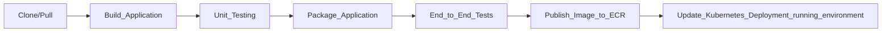

# 3-Tier Demo-Crm Application

> A SaaS-based microservices application demonstrating DevOps best practices with CI/CD, Kubernetes, Terraform, and AWS infrastructure.
## Table of Contents

- [Overview](#overview)
- [Architecture](#architecture)
- [Technology Stack](#technology-stack)
- [Prerequisites](#prerequisites)
- [Getting Started](#getting-started)
- [CI/CD Pipeline](#cicd-pipeline)


## Overview

This project showcases a SaaS-based application deployed on AWS using Kubernetes, with CI/CD automation through GitHub Actions. The project emphasizes:
Key features:

- Cloud-based infrastructure (AWS with Terraform)
- Microservices deployment using Kubernetes
- CI/CD automation via GitHub Actions
- Database integration with MongoDB
- Containerization using Docker & ECR

## Key Features
- REST API-based application using Next.js/Node.js
- Infrastructure as Code with Terraform
- Kubernetes cluster setup with EKS
- Helm-based service deployment
- CI/CD workflows with automated testing & deployment

## Architecture

**3-Tier application architecture Diagram**


-----------------------------------

**AWS infrastructure architecture Diagram**


-----------------------------------
**Comprehensive diagram**


## Technology Stack

| Category             | Technologies   |
| -------------------- | -------------- |
| **Infrastructure**   | AWS, Terraform |
| **Containerization** | Docker, ECR    |
| **CI/CD**            | GitHub Actions |
| **Version Control**  |    GitHub      |
| **Application**      | Next.js, Node.js, React|
| **Database**         | MongoDB |

## Prerequisites

Requirements for building and running the project:

- AWS CLI configured
- Terraform installed
- Kubernetes CLI (kubectl) installed
- Docker & Docker Compose installed
- Helm package manager installed

**Note: Infrastructure file are in Infrastructure_Portfolio(Terraform)**


**Note: Cluster Resources file for Deployment are in ClusterResources_Portfolio(K8s)**


## Getting Started


### Infrastructure Setup

1. **Initialize Terraform & Configure AWS:**

```bash
aws configure
# set your Access Key & Secret Key or use AWS IAM 
terraform init
terraform plan
terraform apply
# make sure to shoutdown Infrastructure when finish with :
terraform destroy
```

### Application Deployment

2. **Configure a StorageClass - create volume in the cloud for MongoDB database**

```bash
kubectl apply -f sc-ebs-csi-gp3.yaml
```

3. **Setup and Deploy MongoDB (using Helm)**

```
helm repo add bitnami https://charts.bitnami.com/bitnami
helm install -f dbvalues.yaml my-mongodb bitnami/mongodb --version 16.4.3
```

```
#Expected output
export MONGODB_ROOT_PASSWORD=$(kubectl get secret --namespace default mymongodb -o jsonpath="{.data.mongodb-root-password}" | base64 -d)

To connect to your database, create a MongoDB® client container:

    kubectl run --namespace default mymongodb-client --rm --tty -i --restart='Never' --env="MONGODB_ROOT_PASSWORD=$MONGODB_ROOT_PASSWORD" --image docker.io/bitnami/mongodb:8.0.5-debian-12-r0 --command -- bash

Then, run the following command:
mongosh admin --host "my-mongodb-0.my-mongodb-headless.default.svc.cluster.local:27017,my-mongodb-1.my-mongodb-headless.default.svc.cluster.local:27017" --authenticationDatabase admin -u root -p $MONGODB_ROOT_PASSWORD
```

**run the three** 

3. **Deploy Next.js/Node.js Application (using Helm)**

```
helm install demo-crm .
```

4. **Set Up Ingress Controller**

```
helm repo add ingress-nginx https://kubernetes.github.io/ingress-nginx

helm install -n ingress --create-namespace controller ingress-nginx/ingress-nginx --set controller.ingressClassResource.default=true
kubectl apply -f demo-crm-ingress.yaml

#check creation
kubectl get service -n ingress
```

```
kubectl apply -f demo-crm-ingress.yaml

#check creation
kubectl get ingress
```

### Resources Cleaning

5. **Uninstalling MongoDB Using Helm**
```
helm list
helm delete my-mongodb
```

6. **Verifying Resources**
```
kubectl get all
kubectl get svc
kubectl get sc
```

7. **Deleting Storage Class**
```
kubectl delete sc ebs-gp3
```

8. **Deleting Persistent Volume Claims (PVCs)**
```
kubectl get pvc
kubectl delete pvc --all
```

9. **Uninstalling Application Using Helm**
```
helm uninstall demo-crm
```


9. **Uninstall Nginx Ingress Controller Using Helm**
```
helm uninstall controller -n ingress
#verify action
helm list -n ingress
```

10. **Delete Ingress Resource**
```
kubectl delete -f demo-crm-ingress.yaml
```

11. **Delete the Namespace**
```
kubectl delete namespace ingress

#Verify actions
kubectl get all -n ingress
kubectl get ingress -n ingress
```


**Note: must setup a domain and DNS record that will point to our Ingress Controller’s singular Load Balancer service**


## CI/CD Pipeline

**PIPELINE DESCRIPTION**



> Project related repositories:

- https://github.com/tamer98/Infrastructure_Portfolio
- https://github.com/tamer98/ClusterResources_Portfolio

